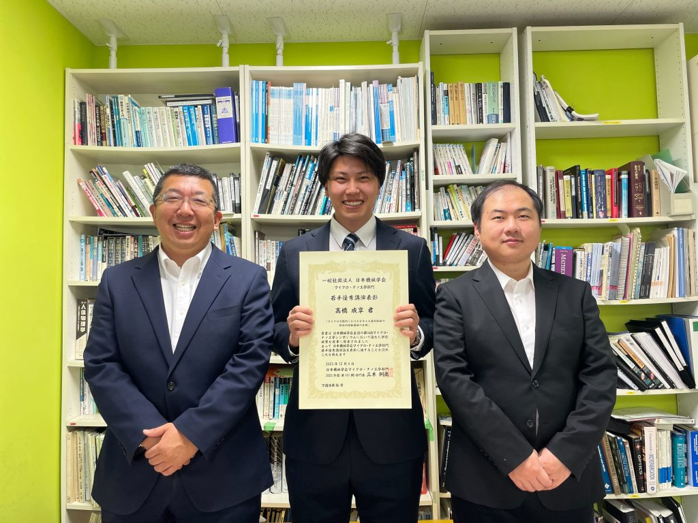

<!--StartFragment-->

機械工学専攻の髙橋成享さん（博士前期課程2年）が、日本機械学会 マイクロ・ナノ工学部門 若手優秀講演表彰を受賞しました。

<!--EndFragment-->

<!--StartFragment-->

（受賞した髙橋さんより）\
第14回マイクロ・ ナノ工学シンポジウムでの「マイクロ流路内における分子人工筋肉駆動の断続的回転運動の実現」という発表により受賞しました。日本機械学会マイクロ・ナノ工学部門ではマイクロ・ナノメートルの領域における工学・理学に機械工学がさらなる主体的貢献を行うことを目的とし、マイクロ・ナノ工学シンポジウムを開催しています。\
私が発表した研究では半径が500µm以下の回転機構を1つのマイクロ流路の中で部品の製作から組み立てまでを行い、さらに分子人工筋肉を用いることで生体エネルギーを駆動源として光制御可能な回転に成功しました。

<!--EndFragment-->